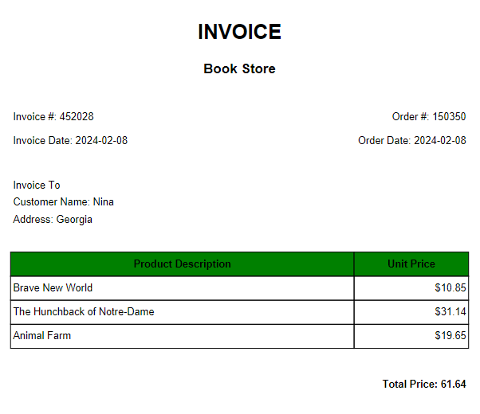

<div style="text-align:center; color: rgb(106, 90, 205)"> <h1> Bookstore Application </h1> </div> 


Video Demo: [Bookstore Application](https://www.youtube.com/watch?v=VRysnDYjQVU)

----------
<h4 style="text-align:center; font-weight: bold;"> Welcome to the Bookstore Application! </h4>

 This Python program is created for managing a bookstore. The application allows users to browse through various book categories, add books to their shopping bag and proceed to checkout. It also provides the functionality to generate an invoice for the purchased books.
 
 The application uses data, dinamically stored in a file `collections.xlsx`, from [Goodreads books collections](https://www.goodreads.com/list?ref=nav_brws_lists).


## Description and Features:

### Features
- Browse through multiple book categories.
- View a list of books in each category.
- Add books to the shopping cart.
- Remove books from the shopping cart.
- View the shopping cart and total price.
- Checkout and generate an invoice PDF.


### Main Functions Descriptions

**`The main function`** serves as the entry point of the program. It starts by displaying a greeting message and initializing some variables. It then enters a while loop that allows users to navigate through the different categories and perform various actions such as choosing a book to buy, navigating between pages, and checking out.

**Category Selection**:  ["Books You Must Read Before You Die"](https://www.goodreads.com/list/show/952.1001_Books_You_Must_Read_Before_You_Die), ["Science Fiction & Fantasy"](https://www.goodreads.com/list/show/2700.Science_Fiction_and_Fantasy_Must_Reads), ["History Books,"](https://www.goodreads.com/list/show/1362.Best_History_Books_), ["Memoir/Biography/Autobiography"](https://www.goodreads.com/list/show/281.Best_Memoir_Biography_Autobiography), ["Motivational and Self-Improvement Books"](https://www.goodreads.com/list/show/7616.Motivational_and_Self_Improvement_Books) and The Best Books of the ["17th"](https://www.goodreads.com/list/show/53), ["18th"](https://www.goodreads.com/list/show/30), ["19th"](https://www.goodreads.com/list/show/16), ["20th"](https://www.goodreads.com/list/show/6), ["21st"](https://www.goodreads.com/list/show/7) Centuries.


**`The create_collection function`** creates a collection of books, category based on user's choice. Function fetches book information from the Goodreads website, parses HTML content and extracts relevant details like title and author, generates random prices, and stores data in an Excel sheet named according to the collection number.

**`The load_books function`** loads books list from the Excel sheet corresponding to the given collection number. It returns a list of books, within the specified range, tabulated in a grid format.

**Browsing Books**: Within each category, users can navigate through multiple pages of books and view details such as title, author, and price

```
+-----+---------------------------------------------------------------------------------+-------------------------------------------+----------+   
|   N | 📝 Title                                                                        | 🤓 Author                                 | 💲Price  |
+=====+=================================================================================+===========================================+==========+   
|   1 | Hamlet                                                                          | William Shakespeare                       | 25.5$    |   
+-----+---------------------------------------------------------------------------------+-------------------------------------------+----------+   
|   2 | Macbeth                                                                         | William Shakespeare                       | 11.04$   |   
+-----+---------------------------------------------------------------------------------+-------------------------------------------+----------+
|   3 | Don Quixote                                                                     | Miguel de Cervantes Saavedra              | 14.38$   |
...
+-----+---------------------------------------------------------------------------------+-------------------------------------------+----------+
|  99 | The Leopard                                                                     | Giuseppe Tomasi di Lampedusa              | 17.62$   |
+-----+---------------------------------------------------------------------------------+-------------------------------------------+----------+
| 100 | Thérèse Raquin                                                                  | Émile Zola                                | 39.23$   |
+-----+---------------------------------------------------------------------------------+-------------------------------------------+----------+ 
📌 Page - 2 / 3
```

**`The buy_book function`** serves to add book to the cart. It prompts the user to select a book from the displayed list and returns the updated shopping bag and total price.


**`The checkout function`** displays the options available to the user such as Checking out, Adding more books to the cart, Removing undesired ones or Canceling the checkout process.

**Shopping Cart**: Users can review the item(s) added to the shopping bag.
```
📌 Items:
 -  --------------------
1  The Leopard - $17.62
2  Hamlet - $25.5
-  --------------------
📌 Total Price: $43.12
```

**Checkout**: At checkout, users can confirm payment, enter their personal information to an invoice for their purchase.

**`The create_invoice function`** collects customer information - name and address, and generates a PDF invoice for the purchased books..


<div style="text-align:center;">  </div>

**`The exit function`** ensures proper cleanup of the Excel workbook and gracefully terminates program execution with an exit message. It's typically used whenever the user chooses to exit or when the purchase is already done.

----------
----------


## Installation and usage:
1. Clone the repository or download the source code files.
```
git clone https://github.com/ninaniel/
```

2. Install the required dependencies:
```
pip install -r requirements.txt
```

3. Run the project.py file to start the application:
```
python project.py
```

4. Follow the on-screen prompts to browse books, add them to your cart, and proceed to checkout.

## Dependencies:

- `Requests` For making HTTP requests in Python. *Used to fetch book information from the Goodreads website.*
- `BeautifulSoup` For pulling data out of HTML and XML files. *Used for web scraping to extract book information from the fetched web pages.*
- `OpenPyXL` For reading and writing Excel files. *Used to store and manage book collections in Excel sheets.*
- `Tabulate` For creating nicely formatted tables. *Used to display book information in a tabular format during the browsing and checkout process.*
- `FPDF` For generating PDF files. *Used to create invoices for purchased books.*

## Credits

This application was created by <span style="color: rgb(106, 90, 205); font-weight: bold; "> Ninaniel </span>